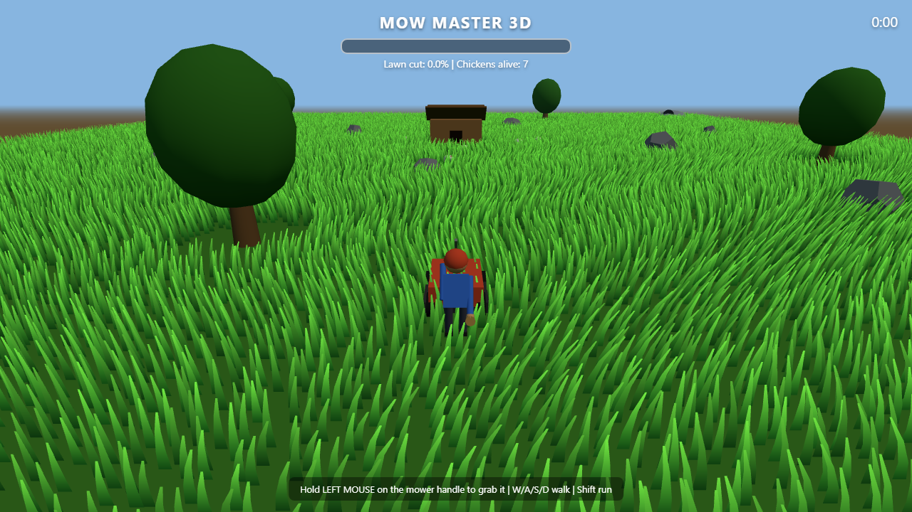

# Mow Master 3D

A 3D lawn-mowing game built with Three.js in a single HTML file.



**[Play it now on GitHub Pages](https://ferozaffs.github.io/mow-master-3d/)**

## The Goal

Mow **99% of the lawn** — while defending your 7 chickens from fat, chicken-snatching lawn gnomes. Lose every chicken and the gnomes win.

## How to Play

| Action | Input |
|---|---|
| Walk / steer | `W` / `A` / `S` / `D` (or arrow keys) |
| Run | `Shift` |
| **Grab / release the mower** | Hold **left mouse button** near the mower's handle |
| **Swing the bat** | Left-click anywhere away from the handle |

- When you grab the mower, you drive it; release the mouse and you detach and walk around freely.
- Clicking while on foot swings the bat — any gnome in front of you gets **hit like a baseball** and flies off, dropping any chicken it was carrying.
- Gnomes emerge from the four corner caves. They're faster than chickens, and spawn pressure ramps up as your lawn gets cut — frenzied in the last 10%.
- A chicken goes limp in a gnome's arms as it's hauled to the nearest cave. Catch up and rescue it!
- Chickens wander and flee, and head back to the coop if they stray too far.

## Features

- 46,000 GPU-instanced animated grass blades with a wind shader (gusts, per-blade sway, cut stubble coloring)
- Cutting with spatial hashing, grass-clipping particle spray, and a driving mower (vibration, spinning wheels, engine audio)
- A gardener character with walk-cycle leg animation, bat swings and hands on the handle
- Chicken coop, trees, rocks, and four gnome caves around the map
- Fully embedded sound: procedural MP3 soundtrack (waltz w/ Karplus-Strong guitar + whistle lead), mower engine loop, footsteps, bat hits, gnome grumbles, and chicken clucks — all base64-embedded in the page, no external audio files

## Running Locally

Just open `index.html` in a browser — it's fully self-contained (the only network request is the Three.js CDN module).

## Rebuilding the Audio

The sound toolkit requires Python, numpy, and ffmpeg:

```powershell
cd tools
python gen_audio.py        # synthesizes wav files
ffmpeg -i wav/music.wav ... # converts to mp3 (see loop below)
python inject_sounds.py    # base64-embeds mp3s into ../index.html
```

## License

MIT
